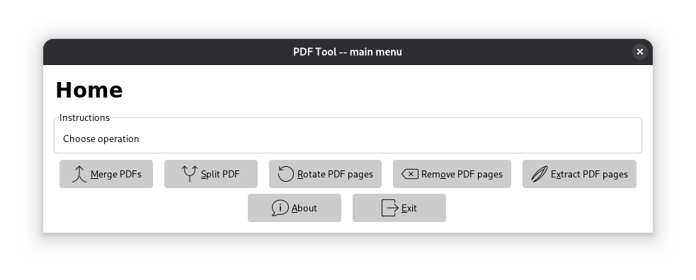
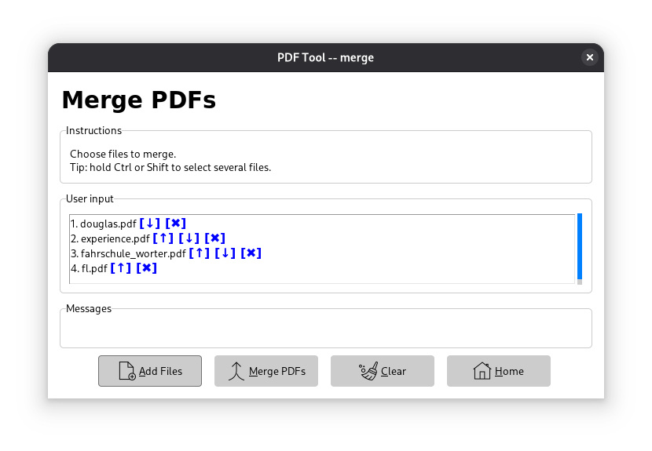

# PDF Tool

A cross-platform desktop application for common PDF manipulation tasks, built with Go and the Tk9.0 GUI toolkit with azure theme. This tool provides a simple graphical interface to merge, split, rotate, remove, and extract pages from PDF documents.

## Table of Contents

- [Features](#features)
- [Screenshots](#screenshots)
- [Installation](#installation)
- [Usage](#usage)
- [Todo](#todo)
- [Contributing](#contributing)
- [License](#license)
- [Acknowledgements](#acknowledgements)

## Features

- **Merge PDFs:** Combine multiple PDF files into a single document.
- **Split PDF:** Divide a single PDF into multiple smaller files.
- **Rotate PDF Pages:** Rotate specific pages within a PDF document or the whole document.
- **Remove PDF Pages:** Delete unwanted pages from a PDF.
- **Extract PDF Pages:** Save specific pages from a PDF into a new file.
- Hotkeys for all actions
- "It was over before I knew it"

## Screenshots

Home screen:



Merge screen:



## Installation

Unpack and enjoy.

### Prerequisites

-   **Go:** This project was developed with Go `1.24.6`. While older versions might work, using this version or newer is recommended.
    -   [Download and Install Go](https://go.dev/doc/install)

### Building from Source

1.  **Clone the repository:**
    ```bash
    git clone https://github.com/ikostas/pdf-tool.git
    cd pdf-tool
    ```

2.  **Build the application:**
    ```bash
    go build -o pdf-tool .
    ```

Icons are not compiled into the binary, by the way.

## Usage

After installation, you can run the executable:

```bash
./pdf-tool
```

Or according file for Windows.

The application will launch its main menu, from which you can select the desired PDF operation. Follow the on-screen instructions for each function.

Hotkeys are Alt+ an underlined letter.

## Todo

- i18n
- Implement more features from pdfcpu library

## Contributing

Contributions are welcome! If you find a bug or have a feature request, please open an issue. If you'd like to contribute code, please fork the repository and submit a pull request.

## License

This project is licensed under the GNU General Public License v3.0. See the [LICENSE](LICENSE) file for details.
*(Note: You will need a `LICENSE` file in your repository with the full GPLv3 text.)*

## Acknowledgements

-   **pdfcpu:** For robust PDF manipulation functionalities.
    -   [github.com/pdfcpu/pdfcpu](https://github.com/pdfcpu/pdfcpu)
-   **modernc.org/tk9.0:** For the Go bindings to the Tk GUI toolkit.
    -   [modernc.org/tk9.0](https://pkg.go.dev/modernc.org/tk9.0)
-   **Icons8:** For the application icons.
    -   [icons8.com](https://icons8.com)
